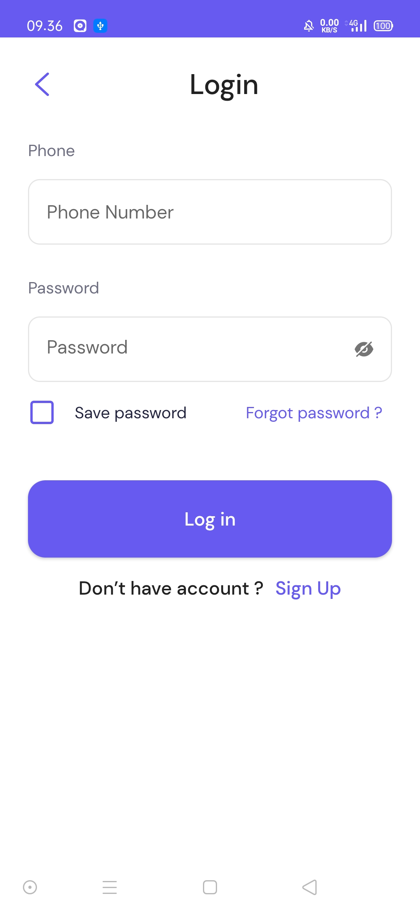
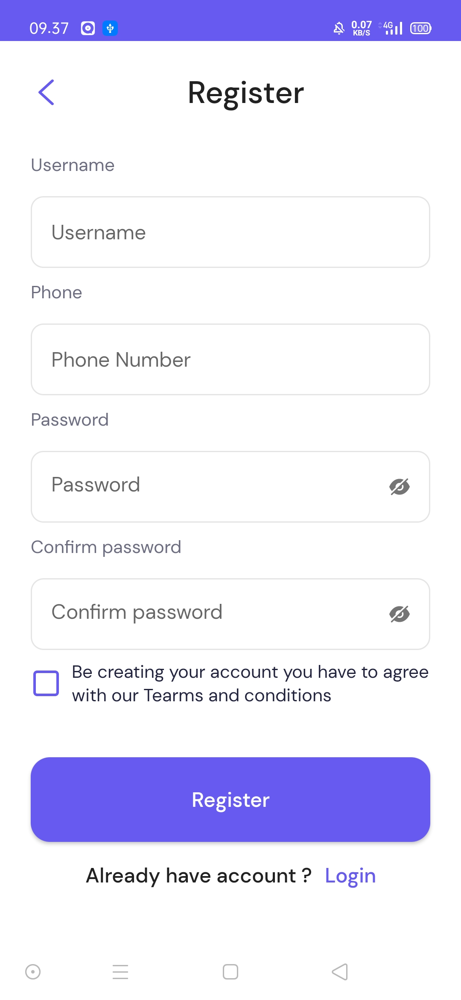

<h1>Jetpack Compose UI Design</h1>

    

Repository ini hanya berupa slicing design ui android native dengan menggunakan jetpack compose, sehingga yang artinya adalah applikasi ini tidak memiliki kemampuan untuk memproses data secara real hanya mampu memproses data secara dummy, dan repository ini akan di update lagi 🐱‍👤.

<h2>Screenshot</h2>

    
    
    

